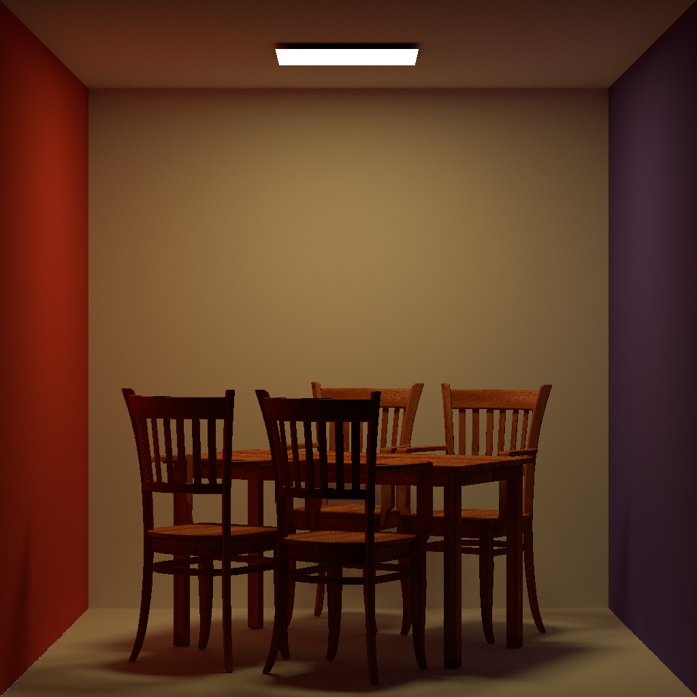

## 如何运行

### 依赖

#### 项目内

[`tinyobjloader`](https://github.com/tinyobjloader/tinyobjloader)：载入 obj 和材质

[`tinyxml2`](https://github.com/leethomason/tinyxml2)：载入 xml 配置文件

[`stb`](https://github.com/nothings/stb)：读入材质贴图

#### 项目外

`OpenCV`：存储渲染结果到 EXR

`Eigen`：矩阵库，向量储存与计算

`OpenMP`：多线程库，加速渲染

### 获取代码

```bash
git clone https://github.com/bhiaibogf/path-tracer.git
```

### 安装依赖

```bash
sudo apt install libeigen3-dev libopencv-dev
```

### 编译

```bash
cd path-tracer && mkdir build && cd build && cmake .. && make && cd ..
```

### 运行

```bash
./path_tracer
```

## 使用说明

### 场景

见 scenes 文件夹下的 [README](./scenes/README.md)，请保证场景文件夹名、模型名、配置文件名的一致

### 控制

请更改 main 函数内变量来控制渲染细节

| 参数           | 含义                                   |
|--------------|--------------------------------------|
| model_name   | 场景名                                  |
| spp          | 单位像素采样数                              |
| antialiasing | 是否开启 antialiasing                    |
| use_bvh      | 是否使用 BVH                             |
| sample_type  | 最后一个 bounce 如何采样（BSDF / light / MIS) |

## 源码说明

### 相机（camera 目录）

### 射线与交点（ray 目录）

### 几何基元（geometry 目录）

### 材质（material 目录）

### 场景（scene 目录）

### BVH（bvh 目录）

### 渲染器（renderer 目录）

### 工具（utils 目录）

## 运行结果

### 测试环境

```txt
OS: Ubuntu 20.04 focal(on the Windows Subsystem for Linux)
Kernel: x86_64 Linux 5.10.60.1-microsoft-standard-WSL2
GTK Theme: Adwaita [GTK3]

CPU: Intel Core i5-9400F @ 6x 2.904GHz
RAM: 7928MiB

g++ (Ubuntu 9.3.0-17ubuntu1~20.04) 9.3.0
cmake version 3.16.3
```

### cornell-box（512spp）



| 16spp time | MIDDLE | EQUAL_COUNT | SAH    |
|------------|--------|-------------|--------|
| 构建         | 0.008  | 0.015       | 7.668  |
| 渲染         | 62.415 | 142.119     | 58.658 |

### veach-mis（512spp）


| 16spp time | MIDDLE | EQUAL_COUNT | SAH    |
|------------|--------|-------------|--------|
| 构建         | 0.001  | 0.002       | 0.406  |
| 渲染         | 19.952 | 33.132      | 18.264 |

### bedroom（4096spp）


| 16spp time | MIDDLE                  | EQUAL_COUNT     | SAH |
|------------|-------------------------|-----------------|-----|
| 构建         | 0.367/0.387/16879.1     | 0.547/0.516     | /   |
| 渲染         | 147.449/196.571/6079.65 | 326.664/461.143 | /   |
