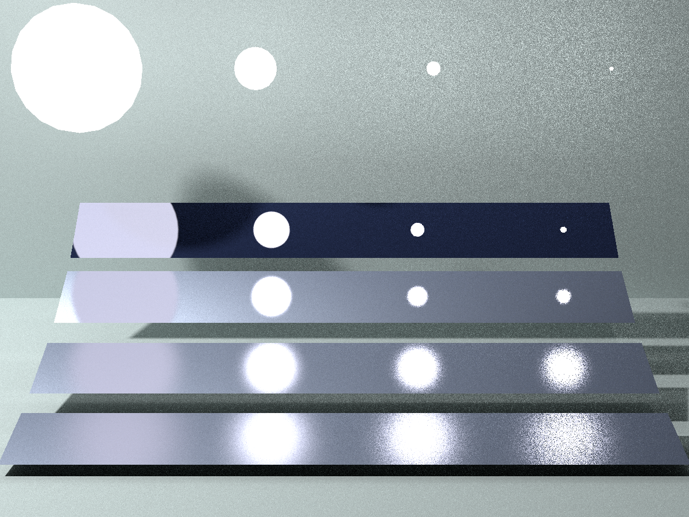
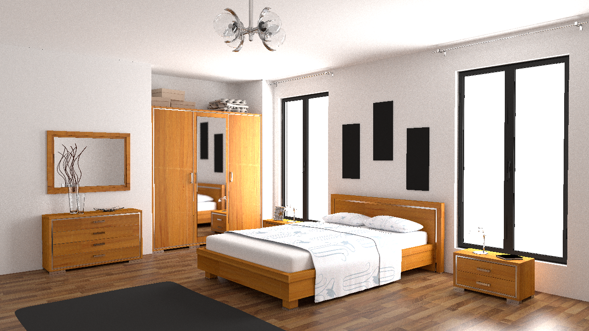

## 如何运行

### 依赖

#### 项目内

[`tinyobjloader`](https://github.com/tinyobjloader/tinyobjloader)：载入 obj 和材质

[`tinyxml2`](https://github.com/leethomason/tinyxml2)：载入 xml 配置文件

[`tinyexr`](https://github.com/syoyo/tinyexr)：存储渲染结果到 EXR

[`stb`](https://github.com/nothings/stb)：读入材质贴图

[`thread-pool`](https://github.com/bshoshany/thread-pool)：多线程库，用于构建 BVH

#### 项目外

`Eigen`：矩阵库，向量储存与计算

`OpenMP`：多线程库，加速渲染

### 获取代码

```bash
git clone https://github.com/bhiaibogf/path-tracer.git
```

### 安装依赖

```bash
sudo apt install g++ cmake make libeigen3-dev libopencv-dev
```

### 编译

```bash
cd path-tracer && mkdir build && cd build && cmake -DCMAKE_BUILD_TYPE=Release .. && make && cd ..
```

### 运行

```bash
./path_tracer
```

## 使用说明

### 场景

见 scenes 文件夹下的 [README](./scenes/README.md)，请保证场景文件夹名、模型名、配置文件名的一致

### 控制

请更改 ini 配置文件来控制渲染细节

| 参数                        | 含义                                                 |
|---------------------------|----------------------------------------------------|
| model_path                | 场景文件夹，默认为 scenes                                   |
| model_name                | 场景名（场景文件夹名、模型名、配置文件名）                              |
| spp                       | 单位像素采样数                                            |
| antialiasing              | 是否开启 antialiasing                                  |
| use_bvh                   | 是否使用 BVH                                           |
| shading_type(g buffer)    | 确定输出那种 GBuffe(uv, albedo, normal, position, depth) |
| shading_type(sample type) | 最后一个 bounce 如何采样（BSDF / light / MIS)               |

## 源码说明

### 相机（camera 目录）

#### Camera 类

1. 储存相机参数
2. 生成光线
3. 计算光线对应的缓存位置

### 射线与交点（ray 目录）

#### Intersection 结构体

+ 储存交点处的材质信息、几何信息

#### Ray 类

1. 储存光线起点、方向与前进信息
2. 判断光线是否打到更近的物体

### 几何基元（geometry 目录）

#### 基类 Primitive

1. 储存几何基元的几何信息
2. 计算 ray 和基元的焦点
3. 在几何基元表面均匀采样

有子类：三角形类 Tiangle，三角形面片 Mesh，球 Sphere

### 材质（material 目录）

#### 基类 Material

1. 储存材质信息
2. 储存自发光信息
3. 计算 BSDF 值
4. 根据 BSDF 采样光线
5. 给定光线计算采样 pdf

有子类：Lambert（漫反射材质），Phong(镜面反射材质)，Refraction（折射材质），Mix（混合材质）

另外有 Texture 类用于读取、储存并采样材质

### 场景（scene 目录）

#### Object 类

+ 储存几何基元 Primitive 与材质 Material 的对应关系

#### AliasTable 类

+ $O(1)$ 时间进行离散面积的采样，用于对光源采样

#### Scene 类

1. 储存场景信息
2. 渲染场景

### BVH（bvh 目录）

#### Bound 类

1. 储存 aabb
2. 包围盒与点的计算
3. 包围盒之间的计算

#### Node 类

1. BVH 节点
2. 支持多线程递归构建
3. 支持多种剖分策略

#### BVH 类

+ 使用场景 Primitive 构建 BVH 并提供求交操作

### 渲染器（renderer 目录）

#### PathTracer 类

1. 储存 Camera 与 Scene
2. 渲染并储存结果

### 工具（utils 目录）

#### XmlLoader 类

+ 解析场景配置文件

#### ObjLoader 类

+ 解析模型

#### Timer 类

+ 计算运行时长

#### generator 命名空间

+ 产生随机数

#### global 命名空间

+ 一些常数与常用的操作

## 运行结果

### 测试环境

```txt
OS: Ubuntu 20.04 focal(on the Windows Subsystem for Linux)
Kernel: x86_64 Linux 5.10.60.1-microsoft-standard-WSL2
GTK Theme: Adwaita [GTK3]

CPU: Intel Core i5-9400F @ 6x 2.904GHz
RAM: 7928MiB

g++ (Ubuntu 9.3.0-17ubuntu1~20.04) 9.3.0
cmake version 3.16.3
```

### cornell-box（512spp）


| 16spp time | MIDDLE | EQUAL_COUNT | SAH    |
|------------|--------|-------------|--------|
| 构建         | 0.008  | 0.015       | 7.668  |
| 渲染         | 62.415 | 142.119     | 58.658 |

### veach-mis（512spp）



| 16spp time | MIDDLE | EQUAL_COUNT | SAH    |
|------------|--------|-------------|--------|
| 构建         | 0.001  | 0.002       | 0.406  |
| 渲染         | 19.952 | 33.132      | 18.264 |

### bedroom（512spp）



| 16spp time | MIDDLE                  | EQUAL_COUNT     | SAH |
|------------|-------------------------|-----------------|-----|
| 构建         | 0.367/0.387/16879.1     | 0.547/0.516     | /   |
| 渲染         | 147.449/196.571/6079.65 | 326.664/461.143 | /   |

### cornell-sphere(4096spp with aa)

增加了对球几何体的支持（包括光源和其他物体）


### more

见 [img](./img) 文件夹
